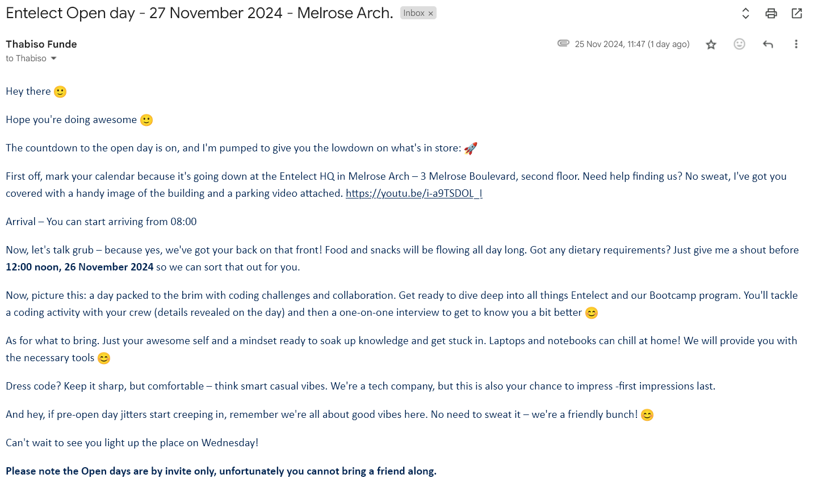
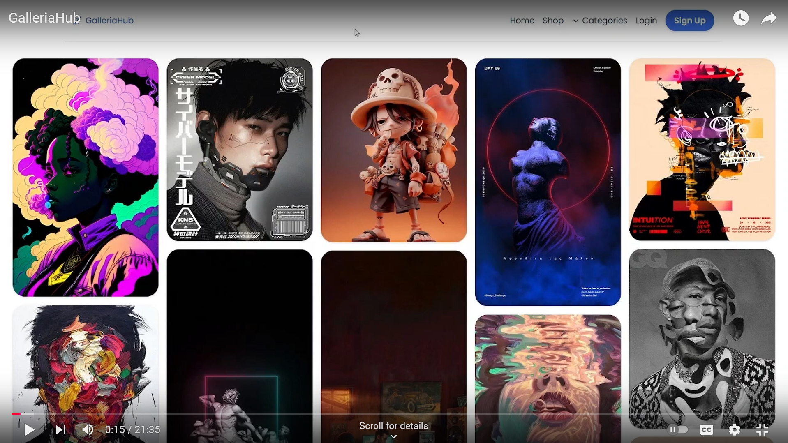
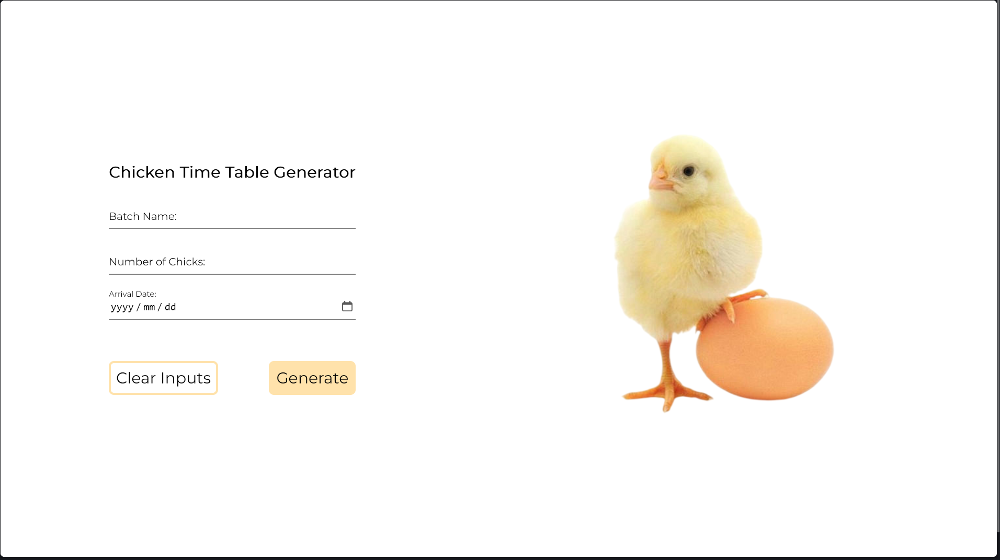
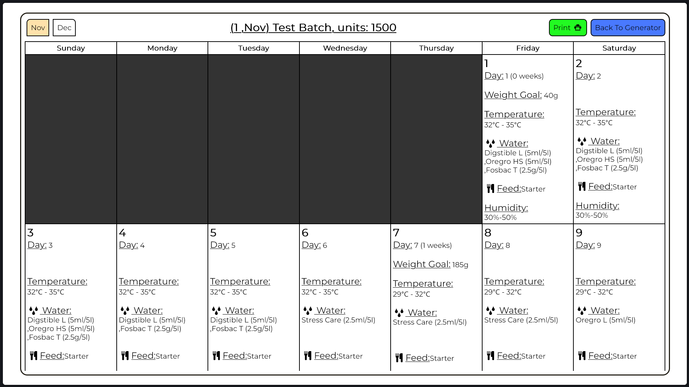

# Ola Muchachos & Chicas 🦦
(I don't speak spanish btw)

## Table of Content 🧾

- [Favorite Languages and Technologies](#favorite-languages-and-technologies)
- [Projects](#projects)
   * [Artisian Service Management & Scheduling](#artisian-service-management-scheduling)
   * [BevStream Music Player](#bevstream-music-player)
   * [GalleriaHub](#galleriahub)
   * [Chicken Timetable Generator](#chicken-timetable-generator)
   * [Interactive Card Form](#interactive-card-form)
- [Let's connect](#lets-connect)
- [About Me](#about-me)
- [Repos, Commit History and Activities](#repos-commit-history-and-activities)
  
## Favorite Languages and Technologies

## Projects

### Artisian Service Management & Scheduling

[YouTube video](https://www.youtube.com/watch?v=z-xXZEdPICg)

(image is a link to YouTube video)

A real-time resource management & scheduling application to streamline the coordination of **equipment, supplies, workers,** and **scheduling for customer requests.**

#### Background

We developed an Artisan Management System designed to streamline the process of connecting customers with skilled artisans across a variety of services. Whether it’s garden care, indoor and outdoor tile installation, or carpet cleaning, our platform allows customers to easily request and manage services while ensuring supervisors and workers can efficiently coordinate resources and schedules.

The project was built with Next.js and React.js on the frontend, ensuring a fast and responsive user experience. The backend API leverages vanilla JavaScript alongside React.js to handle service requests, job allocations, and notifications. For data management, we utilize a MySQL database to store and track customer requests, job details, and resource availability. 

#### Solution

Customers can easily browse through a variety of available services and request the one that suits their needs. Once a request is submitted, supervisors are notified and can accept the service request. The supervisor then conducts an on-site inspection, providing an estimated quotation for the job. After the inspection, the necessary resources and workers are allocated, and the customer is able to schedule a convenient time for the job to be completed. Once the scheduled time arrives, the assigned workers carry out the task, documenting the completed work by taking images, which are then sent to the supervisor for approval. Once the job is verified, the remaining payments are processed, and the job is marked as complete. 

### BevStream Music Player

#### Background

A close friend of mine has always been passionate about music, so for their birthday, I wanted to create something truly special and personal. I decided to develop a music streaming app tailored just for them. The app featured a user-friendly interface, a curated playlist of their favorite genres and artists, and the ability to explore new music. It was designed to reflect their unique taste and style, making it a one-of-a-kind gift. The joy and excitement on their face when they realized it was custom-built for them made all the effort worthwhile.

#### Solution

To create the music streaming app, I leveraged React and Vite to build a fast, responsive, and dynamic user interface. React allowed me to craft a seamless user experience with interactive features, while Vite ensured efficient bundling and a smooth development workflow. To handle the app's assets, including music tracks, cover art, and lyric files, I utilized an S3 bucket. This approach provided secure, scalable, and cost-effective storage, ensuring the files were easily accessible and could support future expansions. The combination of these technologies resulted in a robust, high-performance application that my music-loving friend truly appreciated.

### GalleriaHub

[YouTube](https://www.youtube.com/watch?v=z-xXZEdPICg)
[Repo](https://github.com/ThaBeanBoy/GalleriaHub)

(image is a link to YouTube video)

#### Background

GallariaHub, an online Paint Gallery E-Commerce platform, empowers artists to showcase and sell original artworks directly to customers.

The platform caters to both emerging artists and established painters, offering a diverse collection of paintings that cater to various tastes and preferences. Fosters a creative and supportive community, to make art accessible to a broader audience while providing artists with an avenue to reach a global market. GallariaHub presents an exciting opportunity to transform the way painters and customers interact in the art world. Provides a user-friendly and feature-rich platform, to empower artists while offering art enthusiasts a diverse and immersive shopping experience.

### Chicken Timetable Generator

#### Background

A poultry farm faced significant challenges in organizing and tracking the administration of medicines and feed for their chickens, leading to frequent errors. Without a reliable system, farm workers often struggled to determine the correct schedule for administering medicines, such as antibiotics or vaccines, at specific growth stages. This confusion sometimes resulted in chickens receiving the wrong medication or none at all, increasing the risk of disease outbreaks. Additionally, mismatched timing between feed types and medication left some flocks undernourished or exposed to adverse drug reactions. These missteps not only affected the chickens' health and growth but also posed compliance issues with food safety regulations, jeopardizing the farm's reputation and profitability. The lack of streamlined planning underscored the urgent need for a systematic approach to managing poultry care.

#### Solution

To solve the poultry farm's organizational challenges, I developed a timetable generator tailored to their specific needs. This tool allowed the farm to create clear, structured schedules for administering medicines and distributing the appropriate feed at various stages of the chickens' growth. By referencing this generator, staff could easily follow a systematic plan, eliminating guesswork and reducing the risk of errors. The solution streamlined communication between staff and management, ensuring everyone was aligned with the schedule. As a result, the farm experienced fewer mishaps, healthier chickens, and improved overall operations.

### Interactive Card Form

[Repo](https://github.com/ThaBeanBoy/Front-End-Mentor-Interactive-Card-Details-Form)

I developed an interactive application that enhances user experience by dynamically reflecting the account number on a card displayed in the hero image as the user types it into the form. This real-time visual feedback provides immediate confirmation of the input, creating a more engaging and intuitive interface. To ensure the accuracy and reliability of the data, I implemented comprehensive form validation for the account details. The validation checks included verifying the format, length, and character restrictions of the account number, ensuring the data was correct before submission. This approach streamlined the process, minimized user errors, and improved the overall functionality of the application.

## Let's connect

- [Sololearn](https://www.sololearn.com/profile/14275902)
- [LinkedIn](https://www.linkedin.com/in/tineyi-g-chipoyera-0948b9193/)
- [Leetcode](https://leetcode.com/u/ThaBeanBoy/)
- Engage with a few [YouTube videos](https://www.youtube.com/channel/UCOZwrAkQxKnJhm9OqfUwRdw)

## About Me

I started coding in grade 11, and ever since, it has been a journey of discovery and growth in the world of technology. My passion for development continues to drive me as I aspire to expand my expertise in software development and the infrastructure that powers applications. I am also deeply interested in understanding cybersecurity to build secure systems and exploring how data can be leveraged to drive insights and decision-making in data-driven organizations. My ambition is to become a well-rounded developer who not only writes code but also understands the ecosystem that makes software impactful and secure.

## Repos, Commit History and Activities
