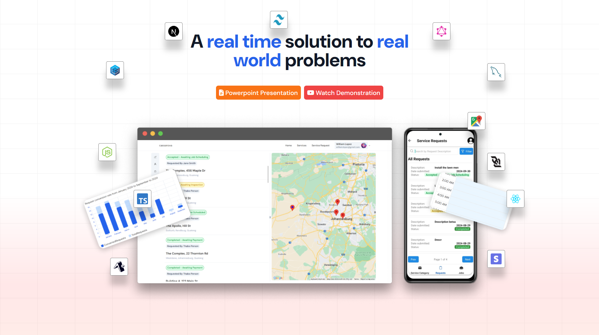

# Ola Muchachos & Chachas 🦦
(I don't speak spanish btw)

## Table of Content 🧾

- [Favorite technologies](#favorite-technologies)
- [Projects](#projects)
   * [Artisian Service Management & Scheduling](#artisian-service-management-scheduling)
      + [Background](#background)
      + [Solution](#solution)
      + [Mobile Application](#mobile-application)
   * [Chicken Timetable Generator](#chicken-timetable-generator)
- [Let's connect](#lets-connect)
- [About Me](#about-me)
- [Repos, Commit History & Activities](#repos-commit-history-activities)
  
## Favorite technologies

## Projects

### Artisian Service Management & Scheduling

(image is a link to YouTube video)

A real-time resource management & scheduling application to streamline the coordination of **equipment, supplies, workers,** and **scheduling for customer requests.**

#### Background

We developed an Artisan Management System designed to streamline the process of connecting customers with skilled artisans across a variety of services. Whether it’s garden care, indoor and outdoor tile installation, or carpet cleaning, our platform allows customers to easily request and manage services while ensuring supervisors and workers can efficiently coordinate resources and schedules.

The project was built with Next.js and React.js on the frontend, ensuring a fast and responsive user experience. The backend API leverages vanilla JavaScript alongside React.js to handle service requests, job allocations, and notifications. For data management, we utilize a MySQL database to store and track customer requests, job details, and resource availability. 

#### Solution

Customers can easily browse through a variety of available services and request the one that suits their needs. Once a request is submitted, supervisors are notified and can accept the service request. The supervisor then conducts an on-site inspection, providing an estimated quotation for the job. After the inspection, the necessary resources and workers are allocated, and the customer is able to schedule a convenient time for the job to be completed. Once the scheduled time arrives, the assigned workers carry out the task, documenting the completed work by taking images, which are then sent to the supervisor for approval. Once the job is verified, the remaining payments are processed, and the job is marked as complete.

#### Mobile Application

To further enhance the accessibility of the system, we developed a mobile application to work in tandem with the web app. The mobile app streamlines customer interactions, allows workers to easily upload images of the worksite, and enables supervisors to capture and store accurate measurements directly from their devices. Our Artisan Management System is designed to optimize the service management process, maintaining flexibility and efficiency to ensure a seamless experience for both customers and workers. 

### BevStream Music Player

### GalleriaHub

### Chicken Timetable Generator

### Writal

## Let's connect

- [Sololearn](https://www.sololearn.com/profile/14275902)
- [LinkedIn](https://www.linkedin.com/in/tineyi-g-chipoyera-0948b9193/)
- [Leetcode](https://leetcode.com/u/ThaBeanBoy/)
- Engage with a few [YouTube videos](https://www.youtube.com/channel/UCOZwrAkQxKnJhm9OqfUwRdw)

## About Me

## Repos, Commit History & Activities
